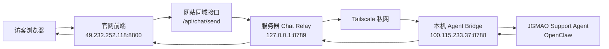

# 坚果猫官网 AI 智能体接入说明

## 1. 目标

当前官网已经接入 `JGMAO Support Agent`，形成这套运行方式：

- 官网前端部署在服务器
- 聊天入口展示在官网悬浮按钮与右侧弹出面板中
- 服务器负责接收前端聊天请求并转发
- 本机负责运行 `JGMAO Support Agent`
- 服务器与本机之间通过 `Tailscale` 私网通信

这套方案的核心原因是：

- 本机配置更高，适合直接运行 agent
- 服务器只负责网站与转发，压力更小
- 前端体验保持统一，不暴露 OpenClaw 原生界面

---

## 2. 当前架构

---

## 3. 当前已打通的链路

当前已经实际验证通过：

- 本地预览站点：`http://127.0.0.1:1688/`
- 线上官网：`http://49.232.252.118:8800`
- 本机 bridge：`http://127.0.0.1:8788/chat`
- 服务器 relay：`http://127.0.0.1:8789/api/chat/send`

已经验证过的效果：

- `1688/api/chat/send` 可以得到 `JGMAO Support Agent` 的真实回复
- `8800/api/chat/send` 可以通过服务器 relay 打到本机 agent，并返回真实回复

---

## 4. 仓库内的关键文件

### 前端

- [src/pages/Home.tsx](/Users/wesleyyu/Documents/New%20project/jgmao-official-site/src/pages/Home.tsx:1)
  - 官网悬浮按钮
  - 右侧固定聊天面板
  - 聊天请求发送逻辑

### 本机 bridge

- [scripts/local-agent-bridge.mjs](/Users/wesleyyu/Documents/New%20project/jgmao-official-site/scripts/local-agent-bridge.mjs:1)
  - 接收聊天请求
  - 调用 `JGMAO Support Agent`
  - 返回 `{ ok, reply }`

### 本地预览服务

- [scripts/local-preview-server.mjs](/Users/wesleyyu/Documents/New%20project/jgmao-official-site/scripts/local-preview-server.mjs:1)
  - 本地站点 `1688`
  - 支持 `/local-chat/message`
  - 支持 `/api/chat/send`

### 服务器 relay

- [scripts/server-chat-relay.mjs](/Users/wesleyyu/Documents/New%20project/jgmao-official-site/scripts/server-chat-relay.mjs:1)
  - 服务器接口 `/api/chat/send`
  - 转发到本机 bridge

### 线上一体化 Web 服务

- [scripts/production-web-server.mjs](/Users/wesleyyu/Documents/New%20project/jgmao-official-site/scripts/production-web-server.mjs:1)
  - 提供官网静态页面
  - 同时代理同域 `/api/chat/send`

### 部署文件

- [deploy/jgmao-chat-relay.env.example](/Users/wesleyyu/Documents/New%20project/jgmao-official-site/deploy/jgmao-chat-relay.env.example:1)
- [deploy/jgmao-chat-relay.service](/Users/wesleyyu/Documents/New%20project/jgmao-official-site/deploy/jgmao-chat-relay.service:1)
- [start_server.sh](/Users/wesleyyu/Documents/New%20project/jgmao-official-site/start_server.sh:1)

---

## 5. 本机系统级文件

这部分**不在仓库里**，而是在本机系统中：

- [com.jgmao.agent-bridge.plist](/Users/wesleyyu/Library/LaunchAgents/com.jgmao.agent-bridge.plist:1)
  - `launchd` 自启动配置
- [run-local-agent-bridge.sh](/Users/wesleyyu/.jgmao/run-local-agent-bridge.sh:1)
  - 本机自启动脚本

用途：

- 登录后自动拉起本机 bridge
- bridge 监听 `8788`
- 供服务器通过 Tailscale 私网访问

---

## 6. 当前网络与机器信息

### 服务器

- 公网地址：`49.232.252.118`
- Tailscale IP：`100.125.217.75`
- 官网端口：`8800`
- relay 端口：`8789`

### 本机

- Tailscale IP：`100.115.233.37`
- bridge 端口：`8788`
- agent：`jgmao-support-agent`

---

## 7. 请求流转说明

访客在官网聊天时，流程如下：

1. 前端将消息发到同域 `/api/chat/send`
2. 线上 Web 服务将请求转给服务器本地 relay
3. relay 通过 Tailscale 请求本机 bridge
4. bridge 调用 `JGMAO Support Agent`
5. agent 回复后，结果回到前端聊天面板

对访客来说：

- 看到的是 `坚果猫AI智能体`
- 不会看到 OpenClaw 原生界面
- 不会跳新窗口

---

## 8. 当前的优点

- 前端体验统一，品牌感一致
- 服务器不承担大模型推理压力
- agent 放在高配置本机，性能更好
- 通过 Tailscale 私网通信，避免直接暴露本机 bridge

---

## 9. 当前仍需注意的点

### 1. 本机必须在线

如果本机关机、休眠、断网，线上聊天会失效。

### 2. bridge 是关键依赖

虽然已经做成自启动，但后续仍建议定期检查：

- 本机 `8788` 是否仍在监听
- `launchd` 是否正常拉起
- 日志是否有异常

### 3. 当前接口响应时间主要取决于 agent

网络转发不是主要瓶颈，真正耗时主要在：

- `JGMAO Support Agent` 的推理时间

通常体感在数秒到十几秒之间。

---

## 10. 推荐的后续优化

### 优先级高

1. 给聊天接口增加流式返回
2. 给 relay 增加限流与更清晰的日志
3. 给本机 bridge 增加更明确的健康检查

### 优先级中

1. 给聊天面板增加“连接中 / 正在思考”状态
2. 优化 `JGMAO Support Agent` 的欢迎语和留资引导
3. 增加失败重试和超时提示

### 优先级低

1. 将 bridge 再做一层更正式的守护脚本
2. 后续如果需要，再评估迁移到更稳定的专用高配机器

---

## 11. 当前结论

截至当前，这套方案已经达到：

- 本地可用
- 线上可用
- 前后端连通
- agent 真回复
- 不暴露 OpenClaw 原生界面

也就是说，`坚果猫官网 AI 智能体` 已经完成第一阶段落地。
