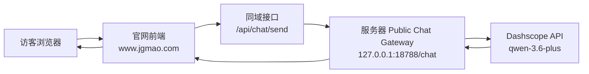

# 坚果猫官网聊天架构说明

## 1. 当前目标

当前官网聊天已经调整为这套分层：

- **对外**：官网访客只使用 `qwen-3.6-plus`
- **对内**：`jgmao-support-agent` 继续保留给飞书和内部内容操作使用

这样做的核心原因是：

- 对外聊天边界更清楚，不暴露 agent 能力
- 不再让访客请求碰到本机文件、工具链或内容操作链路
- 网站聊天更容易做安全收口、限流、统计和兜底

---

## 2. 当前对外架构

这条链路的特点：

- **不再依赖 OpenClaw**
- **不再依赖本机反向隧道**
- **不再依赖 `jgmao-support-agent`**

---

## 3. 当前对内架构

对内仍然保留：

- `jgmao-support-agent`
- 飞书访问
- 官网内容维护、FAQ/洞察生成、内容操作

也就是说：

- **对外**：模型直连
- **对内**：agent 继续服务内部内容工作流

---

## 4. 已打通的链路

当前已经验证通过：

### 本地

- 本地预览站点：`http://127.0.0.1:1688/`
- 本机聊天接口：`http://127.0.0.1:1688/api/chat/send`
- 本机网关：`http://127.0.0.1:8788/chat`

### 线上

- 官网：`https://www.jgmao.com`
- 线上聊天接口：`https://www.jgmao.com/api/chat/send`
- 服务器本地网关：`http://127.0.0.1:18788/chat`

实测结果：

- 本地 `1688` 可以正常返回聊天结果
- `www.jgmao.com/api/chat/send` 可以正常返回聊天结果
- 流式返回已验证通过

---

## 5. 仓库内关键文件

### 前端

- [src/pages/Home.tsx](/Users/wesleyyu/Documents/New%20project/jgmao-official-site/src/pages/Home.tsx:1)
  - 官网聊天面板 UI
  - 前端请求发送逻辑
  - 错误提示、重试、流式处理

### 本机聊天网关

- [scripts/local-agent-bridge.mjs](/Users/wesleyyu/Documents/New%20project/jgmao-official-site/scripts/local-agent-bridge.mjs:1)
  - 现在已变为**本机公共聊天网关**
  - 直接调用 `qwen-3.6-plus`
  - 包含：
    - 敏感信息拦截
    - 秒回规则
    - 中文错误兜底
    - 流式返回

### 服务器聊天网关

- [scripts/public-chat-gateway.py](/Users/wesleyyu/Documents/New%20project/jgmao-official-site/scripts/public-chat-gateway.py:1)
  - 服务器运行的 Python 网关
  - 直接调用 Dashscope `qwen-3.6-plus`
  - 不依赖 Node / OpenClaw

### 本地预览服务

- [scripts/local-preview-server.mjs](/Users/wesleyyu/Documents/New%20project/jgmao-official-site/scripts/local-preview-server.mjs:1)
  - 本地站点 `1688`
  - 支持 `/api/chat/send`

### 线上静态站服务

- [scripts/production-web-server.mjs](/Users/wesleyyu/Documents/New%20project/jgmao-official-site/scripts/production-web-server.mjs:1)
  - 提供官网静态页面
  - 线上域名下 `/api/chat/send` 由 nginx 直接转发到服务器本地 Python 网关

---

## 6. 本机系统级文件

### 本机聊天网关启动脚本

- [run-local-agent-bridge.sh](/Users/wesleyyu/.jgmao/run-local-agent-bridge.sh:1)
  - 本机 `8788` 网关启动脚本
  - 现在读取 Dashscope API Key
  - 不再依赖 OpenClaw

### 本机自启动配置

- [com.jgmao.agent-bridge.plist](/Users/wesleyyu/Library/LaunchAgents/com.jgmao.agent-bridge.plist:1)
  - `launchd` 自启动配置

说明：

- 这两项**不在仓库里**
- 只保存在本机系统中

---

## 7. 服务器侧运行状态

当前服务器 `8.130.11.205` 上运行的是：

- 官网静态站：`127.0.0.1:8080`
- 公共聊天网关：`127.0.0.1:18788`
- nginx：
  - `location /` -> `127.0.0.1:8080`
  - `location = /api/chat/send` -> `127.0.0.1:18788/chat`

服务器聊天网关服务名：

- `jgmao-public-chat.service`

---

## 8. 当前对外聊天能力边界

对外聊天只允许：

- 介绍坚果猫公开能力
- 回答公开 FAQ
- 判断是否适合
- 收集基础需求
- 引导用户通过官网、邮箱、电话继续联系

明确禁止：

- 索要源码
- 索要 SSH / 密钥 / Token / Cookie / 密码
- 索要后台权限
- 暴露内部 Agent / OpenClaw / 飞书工作流

---

## 9. 当前已做的体验层优化

官网聊天目前已经具备：

- 秒回规则
  - 问候语
  - 联系方式
  - 官网优化
  - 增长问题
- 敏感信息拦截
- 中文错误提示
- 流式返回
- 重试体验

---

## 10. 这套架构的优点

### 对外更安全

- 不再暴露 agent 能力
- 不再经过本机 OpenClaw
- 没有本地 session lock 风险

### 对外更稳定

- `www.jgmao.com` 不再依赖你本机在线
- 本机关机不会影响官网聊天

### 对内能力不受影响

- `jgmao-support-agent` 仍然可以继续服务飞书和内部内容操作

---

## 11. 推荐的后续优化

### 高优先级

1. 增加用户级调用统计
   - `sessionId`
   - 用户来源
   - 问题类型
   - token 用量

2. 给服务器网关增加日志与限流
   - 避免被刷
   - 便于分析问题

3. 继续优化对外咨询提示词
   - 更像官网咨询助手
   - 更少模型味

### 中优先级

1. 给对外聊天增加“转人工/邮件/电话”兜底
2. 为高频问题建立更完整的秒回规则库
3. 记录高频问题，为 FAQ / 洞察更新提供候选素材

---

## 12. 当前结论

截至当前，坚果猫官网聊天已经完成从：

- **对外经过本机 agent / OpenClaw**

切换到：

- **对外服务器直连 `qwen-3.6-plus`**

并形成了更清晰的分层：

- **对外**：官网咨询助手
- **对内**：`jgmao-support-agent` 内容与运营助手

这已经是更适合正式官网的架构。
